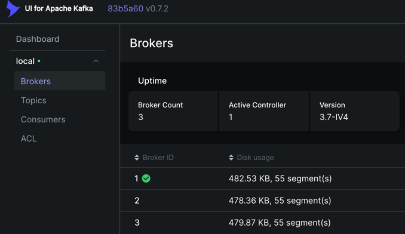
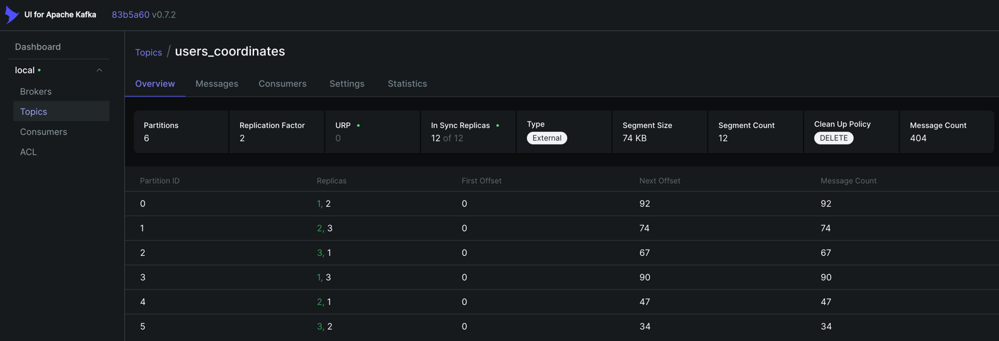
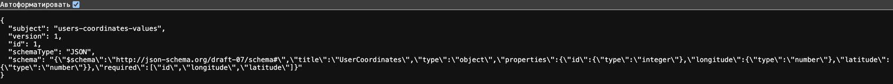

# Проект для работы c кластером Kafka и Schema Registry.

## 💻 Что в проекте

В данном проекте реализовано взаимодействие с кластером Kafka. 
Для отправки и получение сообщений используется Schema Registry.
В проекте используются следующие основные компоненты.

- ✔️ Docker - для сборки проекта.
- ✔️ Kafka + ZooKeeper - для реализации кластера брокера сообщений. 3 broker, 3 zookeeper, 1 kafka ui, 1 kafka schema registry.
- ✔️ Kafka Schema Registry - для регистрации схемы сообщений.
- ✔️ Python - для генерации данных и отправки их в Kafka, а также для считывания из Kafka.
- ✔️ UV - менеджер зависимостей.

## 📖 Описание

В этом проекте при запуске `main.py` выполняется основная логика проекта.
В `schema_registry.py` выполняет регистрация схемы сообщений для topic.
В `simple_producer.py` реализован Kafka producer, который генерирует данные о координатах пользователей и загружает в Kafka topic.
В `simple_consumer.py` реализован Kafka consumer, который считывает сообщения из Kafka topic.

В проекте реализованы следующие шаги:
- ✔️ Создается topic для дальнейшей записи в него и считывания из него.
- ✔️ Создается schema registry для сообщений о координатах пользователей.
- ✔️ Генерируются данные о координатах пользователей, с использованием библиотеки faker.
- ✔️ Сгенерированные данные записываются в Kafka topic. С периодичностью 1 сообщение в секунду.
- ✔️ В процессе записи сообщения в topic осуществляется проверка сообщения на соответствие schema registry.
- ✔️ Сообщения из Kafka topic считываются с помощью python.
- ✔️ В процессе считывания сообщения из topic осуществляется проверка сообщения на соответствие schema registry.

## 📁 Структура проекта

```text
.
├── app/                            # Основной код приложения
│   ├── producers/                      # Kafka producers
│   │   └── simple_producer.py              # Продюсер, отправляющий координаты пользователей
│   ├── consumers/                      # Kafka consumers
│   │   └── simple_consumer.py              # Consumer для чтения и обработки сообщений из Kafka
│   ├── utils/                          # Вспомогательные модули
│   │   ├── kafka.py                        # Конфигурация Kafka (bootstrap servers, топики)
│   │   ├── schema_registry.py              # Работа со Schema Registry и JSON Schema                     
│   │   └── generator.py                    # Генерация тестовых данных (координаты пользователей)
│   └── main.py                      # Точка входа / orchestration (опционально)
├── .env.example                     # Переменные окружения
├── docker-compose.yaml              # Kafka, Schema Registry, UI
├── pyproject.toml                   # Зависимости и конфигурация проекта
├── uv.lock                          # Lock-файл зависимостей
├── .python-version                  # Версия Python
└── README.md                        # Документация проекта
```

## 🚀 Установка

### Клонирование репозитория:

```bash
git clone https://github.com/KimAleksey/Kafka-cluster-with-schema-registry.git
cd Kafka-cluster-with-schema-registry
```

### Установка зависимостей

Установка uv
```bash
curl -LsSf https://astral.sh/uv/install.sh | sh
```
После установки перезапустить терминал.

Создать виртуальное окружение
```bash
uv venv
```

Активировать виртуальное окружение
```bash
source .venv/bin/activate
```

Установить зависимости
```bash
uv sync
```

Создать файл окружения
```bash
cp .env.example .env
```

### Запуск проекта

```bash
docker compose up -d
```

## 🧑‍💻Работа с проектом

### Работа с Kafka.

1. Перейти в http://localhost:8888/.


2. Убедиться что в topic идет запись сообщений.


3. В консоли можно увидеть вот такой лог:
```text
2026-01-17 02:21:29,978 | INFO | root | Bootstrap server: localhost:29092
2026-01-17 02:21:30,020 | ERROR | root | Не удалось создать топик 'users_coordinates': KafkaError{code=TOPIC_ALREADY_EXISTS,val=36,str="Topic 'users_coordinates' already exists."}
2026-01-17 02:21:30,021 | INFO | root | User coordinates topic: users_coordinates
2026-01-17 02:21:30,021 | INFO | root | Schema registry url: http://localhost:8081
2026-01-17 02:21:30,021 | INFO | root | Schema name: users-coordinates-values
2026-01-17 02:21:30,068 | INFO | root | ✅ Схема зарегистрирована. Schema ID: 1
2026-01-17 02:21:30,074 | INFO | root | ✅ Схема users-coordinates-values получена. Schema: {"$schema":"http://json-schema.org/draft-07/schema#","title":"UserCoordinates","type":"object","properties":{"id":{"type":"integer"},"longitude":{"type":"number"},"latitude":{"type":"number"}},"required":["id","longitude","latitude"]}
2026-01-17 02:21:33,491 | INFO | root | Received message: {'id': 2, 'longitude': 150.584389, 'latitude': -14.4893505}
2026-01-17 02:21:33,491 | INFO | root | Received message: {'id': 11, 'longitude': 36.341342, 'latitude': 59.015191}
2026-01-17 02:21:33,491 | INFO | root | Received message: {'id': 90, 'longitude': 94.495258, 'latitude': -34.0614805}
2026-01-17 02:21:33,491 | INFO | root | Received message: {'id': 78, 'longitude': 24.18271, 'latitude': 25.271284}
2026-01-17 02:21:40,457 | INFO | root | Данные пользователя:
{
    "id": 62,
    "longitude": 103.088325,
    "latitude": 2.1956615
}
Delivered to users_coordinates [4]
Delivered to users_coordinates [4]
```
4. В Shema Registry можно посмотреть существующую схему:
[http://localhost:8081/subjects/users-coordinates-values/versions/1](http://localhost:8081/subjects/users-coordinates-values/versions/1)

### Информация по проекту

#### schema_registry.py

Используется для подключения к серверу Schema Registry и регистрации схемы для записи и считывания сообщений о координатах полльзователей.

1. Создается python словарь со следующей структурой:
```python
# Схема для координат пользователей
USERS_COORDINATES_JSON_SCHEMA = {
    "$schema": "http://json-schema.org/draft-07/schema#",
    "title": "UserCoordinates",
    "type": "object",
    "properties": {
      "id": {"type": "integer"},
      "longitude": {"type": "number"},
      "latitude": {"type": "number"}
    },
    "required": ["id", "longitude", "latitude"]
}
```
Здесь важно указать, какие поля и какие типы может иметь сообщение с данной схемой.
2. Далее идет подключение к серверу Shema registry.
3. Далее отправляем post запрос для регистрации схемы:
```python
payload = {
    "schemaType": "JSON",
    "schema": json.dumps(json_schema)
}

response = requests.post(
    f"{url}/subjects/{subject}/versions",
    headers={"Content-Type": "application/vnd.schemaregistry.v1+json"},
    json=payload
)
```
Здесь python словарь сериализуется в json формат и далее передается в post запрос.
4. Проверить, что схема зарегистрировалась можно по ссылке:
[http://localhost:8081/subjects/users-coordinates-values/versions/1](http://localhost:8081/subjects/users-coordinates-values/versions/1)



#### kafka.py

Используется для подключения к Kafka Broker и создания Topic.

1. Подключаемся к Broker.
2. Через AdminClient и NewTopic создаем topic с заданными параметрами:
```python
create_topic(
    topic_name="users_coordinates",
    num_partitions=6,
    replication_factor=2,
    min_insync_replicas=1,
    bootstrap_servers=bootstrap_serv
)
```
3. Зайти в UI Kafka. 
[URL](http://localhost:8888/ui/clusters/local/all-topics?perPage=25)


4. Убедиться что топик существует.


#### generator.py

Используется для генерации данных о координатах пользователей.
Используется библиотека Faker для имитации данных.
Данные в формате:
```python
user_coordinates = {
    "id": random.randint(1,100),
    "longitude": float(fake.longitude()),
    "latitude": float(fake.latitude()),
}
```

#### simple_producer.py

Используется для отправки сообщений в Kafka topic.

1. Получаем сервер брокера, топик, сервер Schema Registry, JSON схемы в формате python словаря.
2. JSON схемы сериализуем в JSON формат в виде строки.
3. Создаем сериализатор JSONSerializer для отправки сообщений в Kafka с проверкой сообщения на соответствие схеме.
4. Создаем конфигурацию Producer.

```python
producer_conf = {
    # Адрес Kafka брокеров
    "bootstrap.servers": bootstrap_server,

    # Сериализатор ключа сообщений — здесь используется IntegerSerializer, так как ключ "id" целочисленный
    "key.serializer": StringSerializer("utf_8"),

    # Сериализатор значения сообщений — JSONSerializer для отправки словаря Python как JSON
    "value.serializer": json_serializer,

    # Количество подтверждений от брокеров для записи сообщения (все)
    "acks": -1,

    # Размер пакета в 1000 байт. Когда накопится нужный объем - запишется в Kafka
    "batch.size": 1000,

    # Ждать до 10 секунды, чтобы собрать больше сообщений. Сработает либо по размеру, либо по времени.
    "linger.ms": 10000,

    # Включает идемпотентность, чтобы не было дубликатов сообщений при повторной отправке.
    "enable.idempotence": True,

    # Количество попыток повторной отправки сообщений при сбоях
    "retries": 100,

    # Максимальное количество сообщений, которые могут быть отправлены одновременно через одно соединение.
    # В сочетании с идемпотентностью нужно держать ≤ 5, иначе возможны перестановки сообщений.
    "max.in.flight.requests.per.connection": 1,
}
```
Из важного:
- Семантика доставки определяется параметром acks. В данном случае -1 (all) означает, что при записи в Kafka producer ожидает подтверждения от мастер брокера и от всех in sync replica.
- Размер пакета или лимит по времени для отправки сообщений определяется параметрами: batch.size и linger.ms. Сработает одно из двух - то есть в Kafka отправится batch сообщений если набрался нужный размер batch или прошло попределенное время.
- Для гарантии, что запись придет только один раз, даже при повторной отправке - используется параметр enable.idempotence.
- Количество попыток определяется параметром retries.

5. Создание самого Producer на основании конфигурационного словаря.

```python
producer = SerializingProducer(producer_conf)
```

Здесь используется SerializingProducer, так как используется кастомный сериализатор с проверкой на соответствие схеме.

6. Далее в бесконечном цикле отправляем сообщение в Kafka.

Для этого:
- Делаем produce. НЕ отправляет сообщение сразу, а кладёт сообщение в локальный buffer. Если приложение упадёт до poll/flush — сообщение пропадёт
- Делаем poll. Реально отправляет сообщения из buffer в Kafka. Принимает ответы от брокеров.
- Делаем flush. Опционально, в данном случае для обработки внештатной остановки программы.

Для produce важно.
> - Сообщение не уходит в сеть мгновенно.
> - Оно кладётся в внутреннюю очередь `librdkafka`.
> - `poll()` или `flush()` служат для того, чтобы клиент обработал очередь:
>   - отправил батчи, которые готовы
>   - получил ответы от брокеров
>   - вызвал колбэки доставки

7. В случае, если отправляемое сообщение не содержит каких либо полей, которые описаны в схеме, при записи в kafka будет ошибка.

```text
During handling of the above exception, another exception occurred:
confluent_kafka.error.ValueSerializationError: KafkaError{code=_VALUE_SERIALIZATION,val=-161,str="'latitude' is a required property"
```

8. Для распределения по партициям используется ключ.

```python
# Отправка сообщения в Kafka
producer.produce(
    topic=users_coordinates_topic,  # Топик, куда отправляем сообщение
    key=str(data["id"]),            # Ключ сообщения (используется для партиционирования)
    value=data,                     # Значение сообщения (словарь с координатами)
    on_delivery=delivery_report,    # Колбэк, который вызывается после доставки (или ошибки)
)
```

#### simple_consumer.py

Используется для получения сообщений из topic и логирования их в консоли.

1. Получаем сервер брокера, топик, сервер Schema Registry, JSON схемы в формате python словаря.
2. JSON схемы сериализуем в JSON формат в виде строки.
3. Создаем десериализатор JSONDeserializer для получения сообщений из Kafka и десериализации его с проверкой сообщения на соответствие схеме.
4. Создаем конфигурацию Consumer.

```python
# Конфигурация Consumer.
python_consumer_conf = {
    # Адрес Kafka брокеров
    "bootstrap.servers": bootstrap_server,

    # Consumer группа.
    "group.id": "simple_consumer.py",

    # Kafka начинает читать сначала, если offset не задан и не найден для Consumer.
    "auto.offset.reset": "earliest",

    # Kafka сама отметит, что сообщения до этого смещения прочитаны.
    "enable.auto.commit": auto_commit,

    # Десериализатор ключа.
    "key.deserializer": StringDeserializer("utf-8"),

    # Десериализатор значения.
    "value.deserializer": json_deserializer,
}
```

Из важного:
- Для указания группы используется group.id.
> group.id в Kafka Consumer — это идентификатор группы потребителей. 
> Он нужен для того, чтобы Kafka могла управлять распределением сообщений между несколькими Consumer и отслеживать смещения (offsets).
- Для указания с какого offset читать если offset для данного Consumer не задан используется параметр auto.offset.reset.
- Для параметризации фиксации offset используется параметр enable.auto.commit.
- Для десериализации сообщений используются параметры key.deserializer и value.deserializer.

5. Создается Consumer с ранее заданным конфигурационным словарем с десериализотором и проверкой схемы.
6. В случае если не указано, с какого offset начать читать - создается подписка на topic, иначе - проставляется offset вручную, с какого читать.

```python
if not reset_offsets:
    # Получаем список партиций
    partitions = consumer.list_topics(users_coordinates_topic).topics[users_coordinates_topic].partitions
    # Вручную задаём offset для каждой партиции.
    consumer.assign([TopicPartition(users_coordinates_topic, p, 0) for p in partitions])
    logging.info("Offsets для всех партиций установлены на 0.")
else:
    # Подписываемся на topic, Kafka сама определяет с какого offset начать.
    consumer.subscribe([users_coordinates_topic])
```

7. В бесконечном цикле считываем сообщение из Topic.

Для этого:
- Делаем poll для получения одного сообщения.
> - poll(timeout) пытается получить одно сообщение из Kafka.
> - Параметр 1.0 = тайм-аут в секундах, то есть poll будет ждать до 1 секунды, если сообщения пока нет. 
> - если сообщений нет после тайм-аута, poll возвращает None.
- Если poll вызвал ошибку ValueDeserializationError, то означает что полученное сообщение не соответствует схеме. Пропускаем его.
- Если сообщений нет, poll вернул None → просто продолжаем цикл
- Если пришла ошибка KafkaError, то нечего читать больше → просто продолжаем цикл
- Десериализуем сообщение с помощью функции value().
- Если все ок и автокоммит - False, то делаем ручной коммит offset.
- Если произошла ошибка при десериализации - пропускаем сообщение.