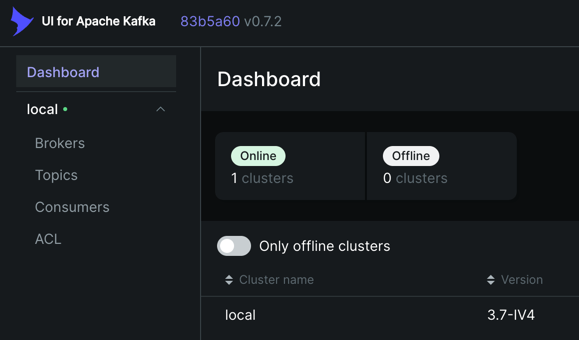

# Проект для работы кластером Kafka и Schema Registry.

## 💻 Что в проекте

В данном проекте реализовано взаимодействие с кластером Kafka. 
Для отправки и получение сообщений используется Schema Registry.
В проекте используются следующие основные компоненты.

- ✔️ Docker - для сборки проекта.
- ✔️ Kafka + ZooKeeper - для реализации кластера брокера сообщений. 3 broker, 3 zookeeper, 1 kafka ui, 1 kafka schema registry.
- ✔️ Kafka Schema Registry - для регистрации схемы сообщений.
- ✔️ Python - для генерации данных и отправки их в Kafka, а также для считывания из Kafka.
- ✔️ UV - менеджер зависимостей.

## 📖 Описание

В этом проекте при запуске `main.py` выполняется основная логика проекта.
В `schema_registry.py` выполняет регистрация схемы сообщений для topic.
В `simple_producer.py` реализован Kafka producer, который генерирует данные о координатах пользователей и загружает в Kafka topic.
В `simple_consumer.py` реализован Kafka consumer, который считывает сообщения из Kafka topic.

В проекте реализованы следующие шаги:
- ✔️ Создается topic для дальнейшей записи в него и считывания из него.
- ✔️ Создается schema registry для сообщений о координатах пользователей.
- ✔️ Генерируются данные о координатах пользователей, с использованием библиотеки faker.
- ✔️ Сгенерированные данные записываются в Kafka topic. С периодичностью 1 сообщение в секунду.
- ✔️ В процессе записи сообщения в topic осуществляется проверка сообщения на соответствие schema registry.
- ✔️ Сообщения из Kafka topic считываются с помощью python.
- ✔️ В процессе считывания сообщения из topic осуществляется проверка сообщения на соответствие schema registry.

## 📁 Структура проекта

```text
.
├── app/                            # Основной код приложения
│   ├── producers/                      # Kafka producers
│   │   └── simple_producer.py              # Продюсер, отправляющий координаты пользователей
│   ├── consumers/                      # Kafka consumers
│   │   └── simple_consumer.py              # Consumer для чтения и обработки сообщений из Kafka
│   ├── utils/                          # Вспомогательные модули
│   │   ├── kafka.py                        # Конфигурация Kafka (bootstrap servers, топики)
│   │   ├── schema_registry.py              # Работа со Schema Registry и JSON Schema                     
│   │   └── generator.py                    # Генерация тестовых данных (координаты пользователей)
│   └── main.py                      # Точка входа / orchestration (опционально)
├── .env.example                     # Переменные окружения
├── docker-compose.yaml              # Kafka, Schema Registry, UI
├── pyproject.toml                   # Зависимости и конфигурация проекта
├── uv.lock                          # Lock-файл зависимостей
├── .python-version                  # Версия Python
└── README.md                        # Документация проекта
```

## 🚀 Установка

### Клонирование репозитория:

```bash
git clone https://github.com/KimAleksey/Kafka-pet-project-1.git
cd Kafka-pet-project-1
```

### Установка зависимостей

Установка uv
```bash
curl -LsSf https://astral.sh/uv/install.sh | sh
```
После установки перезапустить терминал.

Создать виртуальное окружение
```bash
uv venv
```

Активировать виртуальное окружение
```bash
source .venv/bin/activate
```

Установить зависимости
```bash
uv sync
```

Создать файл окружения
```bash
cp .env.example .env
```

### Запуск проекта

```bash
docker compose up -d
```

## 🧑‍💻Работа с проектом

### Работа с Kafka.

1. Перейти в http://localhost:8888/.
2. Убедиться что в topic идет запись сообщений.
3. В консоли можно увидеть вот такой лог:
```text
2026-01-17 02:21:29,978 | INFO | root | Bootstrap server: localhost:29092
2026-01-17 02:21:30,020 | ERROR | root | Не удалось создать топик 'users_coordinates': KafkaError{code=TOPIC_ALREADY_EXISTS,val=36,str="Topic 'users_coordinates' already exists."}
2026-01-17 02:21:30,021 | INFO | root | User coordinates topic: users_coordinates
2026-01-17 02:21:30,021 | INFO | root | Schema registry url: http://localhost:8081
2026-01-17 02:21:30,021 | INFO | root | Schema name: users-coordinates-values
2026-01-17 02:21:30,068 | INFO | root | ✅ Схема зарегистрирована. Schema ID: 1
2026-01-17 02:21:30,074 | INFO | root | ✅ Схема users-coordinates-values получена. Schema: {"$schema":"http://json-schema.org/draft-07/schema#","title":"UserCoordinates","type":"object","properties":{"id":{"type":"integer"},"longitude":{"type":"number"},"latitude":{"type":"number"}},"required":["id","longitude","latitude"]}
2026-01-17 02:21:33,491 | INFO | root | Received message: {'id': 2, 'longitude': 150.584389, 'latitude': -14.4893505}
2026-01-17 02:21:33,491 | INFO | root | Received message: {'id': 11, 'longitude': 36.341342, 'latitude': 59.015191}
2026-01-17 02:21:33,491 | INFO | root | Received message: {'id': 90, 'longitude': 94.495258, 'latitude': -34.0614805}
2026-01-17 02:21:33,491 | INFO | root | Received message: {'id': 78, 'longitude': 24.18271, 'latitude': 25.271284}
2026-01-17 02:21:40,457 | INFO | root | Данные пользователя:
{
    "id": 62,
    "longitude": 103.088325,
    "latitude": 2.1956615
}
Delivered to users_coordinates [4]
Delivered to users_coordinates [4]
```
4. В Shema Registry можно посмотреть существующую схему:
[http://localhost:8081/subjects/users-coordinates-values/versions/1](http://localhost:8081/subjects/users-coordinates-values/versions/1)

### Информация по проекту

#### schema_registry.py

Используется для подключения к серверу Schema Registry и регистрации схемы для записи и считывания сообщений о координатах полльзователей.

1. Создается python словарь со следующей структурой:
```python
# Схема для координат пользователей
USERS_COORDINATES_JSON_SCHEMA = {
    "$schema": "http://json-schema.org/draft-07/schema#",
    "title": "UserCoordinates",
    "type": "object",
    "properties": {
      "id": {"type": "integer"},
      "longitude": {"type": "number"},
      "latitude": {"type": "number"}
    },
    "required": ["id", "longitude", "latitude"]
}
```
Здесь важно указать, какие поля и какие типы может иметь сообщение с данной схемой.
2. Далее идет подключение к серверу Shema registry.
3. Далее отправляем post запрос для регистрации схемы:
```python
payload = {
    "schemaType": "JSON",
    "schema": json.dumps(json_schema)
}

response = requests.post(
    f"{url}/subjects/{subject}/versions",
    headers={"Content-Type": "application/vnd.schemaregistry.v1+json"},
    json=payload
)
```
Здесь python словарь сериализуется в json формат и далее передается в post запрос.
4. Проверить, что схема зарегистрировалась можно по ссылке:
[http://localhost:8081/subjects/users-coordinates-values/versions/1](http://localhost:8081/subjects/users-coordinates-values/versions/1)

#### kafka.py

Используется для подключения к Kafka Broker и создания Topic.

1. Подключаемся к Broker.
2. Через AdminClient и NewTopic создаем topic с заданными параметрами:
```python
create_topic(
    topic_name="users_coordinates",
    num_partitions=6,
    replication_factor=2,
    min_insync_replicas=1,
    bootstrap_servers=bootstrap_serv
)
```
3. Зайти в UI Kafka. 
[URL](http://localhost:8888/ui/clusters/local/all-topics?perPage=25)



4. Убедиться что топик существует.


#### generator.py

Используется для генерации данных о координатах пользователей.
Используется библиотека Faker для имитации данных.


#### simple_producer.py

Используется для отправки сообщений в Kafka topic.